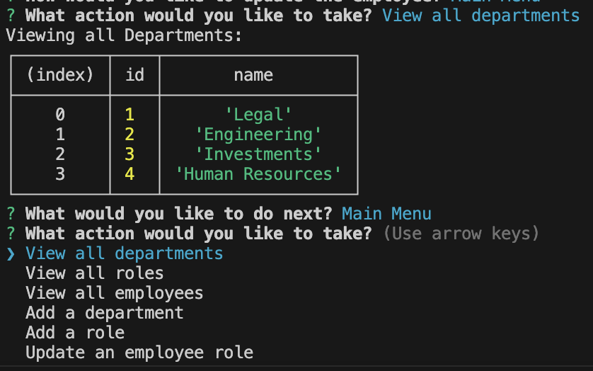

# USAFinancial Database Application

The USAFinancial Database application is a Node.js command-line tool that allows users to view and edit databases using MySQL2 and Inquirer. With this application, you can interact with the USAFinancial database, perform CRUD (Create, Read, Update, Delete) operations on various tables, and manage financial data efficiently.

## Video Walkthrough
[Watch](https://drive.google.com/file/d/1HUWlp1oZ8_tB9LzvT_StYr-_Le1ww3BC/view)



## Prerequisites

Before using the USAFinancial Database application, ensure you have the following software installed on your system:

- Node.js: You can download and install Node.js from the official website (https://nodejs.org).
- MySQL2: Make sure you have MySQL2 installed on your machine to interact with the MySQL database. If not, you can install it using npm.

## Getting Started

1. **Download the Application**: Download the ZIP file of the USAFinancial Database application and extract it to your preferred location.

2. **Install Dependencies**: Open your terminal or command prompt, navigate to the project directory, and run the following command to install the required dependencies (Inquirer and MySQL2):

   ```bash
   npm install inquirer mysql2
   ```

3. **Setup MySQL Database**: Ensure you have a MySQL server running, and create a database named "USAFinancial_db" (or any other desired name) using a MySQL client.

4. **Configure Database Connection**: Open the "index.js" file and modify the database connection parameters to match your MySQL server configuration:

   ```javascript
   const connection = mysql.createConnection({
       host: 'your_mysql_host',
       user: 'your_mysql_user',
       password: 'your_mysql_password',
       database: 'USAFinancial_db', // Replace with your database name
   });
   ```

5. **Initialize the Database**: The application comes with an SQL script (schema.sql) to create the necessary tables for the USAFinancial database. Run the following command to execute the script and set up the tables:

   ```bash
   mysql -u your_mysql_user -p USAFinancial_db < schema.sql
   ```

   You will be prompted to enter your MySQL password.

## Usage

To run the USAFinancial Database application, use the following command:

```bash
node index.js
```

Upon executing the command, the application will start, and you will be presented with a menu of options to interact with the database. The available options typically include:

- View all records in a specific table
- Add a new record to a table
- Update existing records
- Delete records from a table

Simply follow the on-screen instructions and provide the required input when prompted to perform various operations on the database.

## Contributing

If you find any issues or have suggestions for improvements, please feel free to contribute to the project. Fork the repository, make your changes, and submit a pull request with your enhancements. Please contact me via [email](mailto:merel.burleigh@gmail.com).

## License

This application is open-source and released under the [MIT License](LICENSE). You are free to use, modify, and distribute the code as per the terms of the license.

---

Thank you for choosing the USAFinancial Database application! We hope it proves to be a valuable tool for managing financial data efficiently. If you have any questions or need further assistance, please don't hesitate to reach out to us. Happy coding!